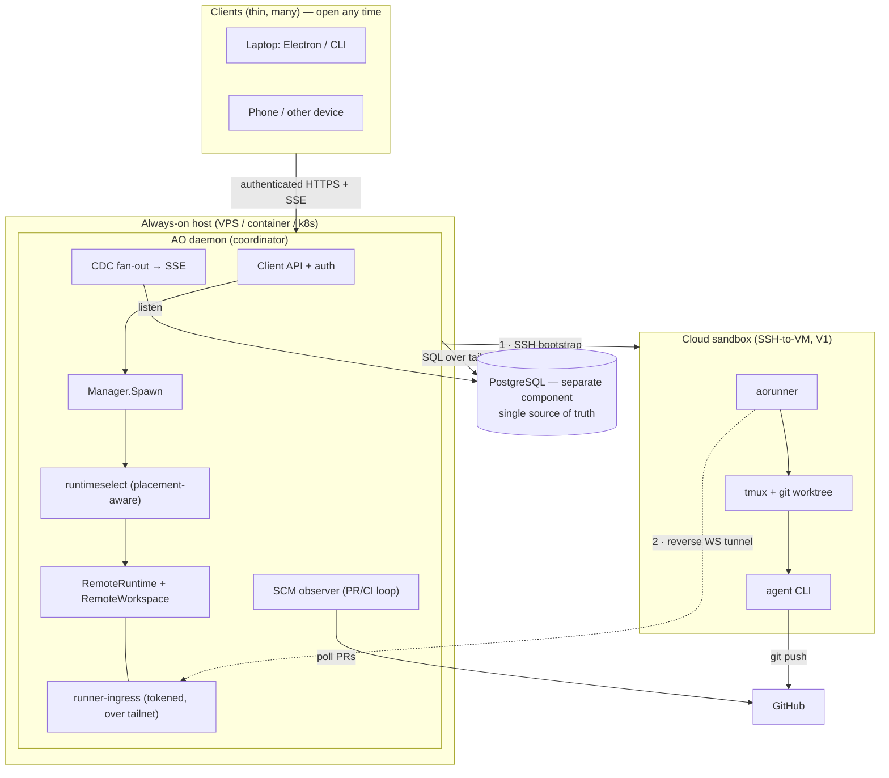
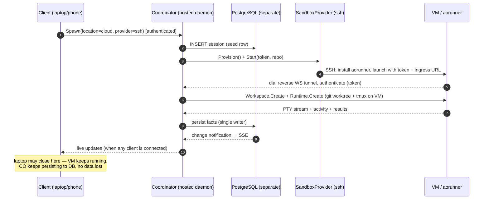

# Design Document: Hybrid Cloud Agents for Agent Orchestrator (AO)

**Author(s):** AO Design Working Group
**Date:** 2026-07-05
**Status:** Draft (rev. 3 — hosted coordinator, separate database, auth + runner protocol)

---

## 1. Context and Scope

### Background / Problem Statement

Agent Orchestrator (AO) runs AI coding agents in parallel, each in an isolated git
worktree, and shepherds their PRs through CI/review. Today AO is **local-first in two
ways at once**, and both must change for cloud agents to be useful:

1. **Execution is local.** Every session runs as a process on the same machine as the
   daemon, via `tmux`/`conpty` around a local PTY. Your laptop is the ceiling; you can't
   close the lid.
2. **The coordinator *is* the laptop.** The daemon runs on your machine, and its state
   is an **embedded SQLite file on that machine's disk** — `~/.ao/data/ao.db`
   (`storage/sqlite/db.go:56`, `config/config.go:301`). The daemon is a
   **loopback, no-auth service** (`httpd/cors.go:13`).

The second point is the fatal flaw for cloud agents. Consider the decisive scenario:

> You launch an agent in a cloud sandbox, then **close your laptop**. The agent keeps
> working on the remote VM — but the daemon (the only DB writer) and its database are on
> the sleeping laptop. **Nothing can be persisted.** Cloud runs that outlive your laptop
> can't record their state, and you can't watch them from your phone.

Running long-lived, remotely-executing agents on a coordinator that sleeps when you close
your laptop is a contradiction. **This revision moves the coordinator off the laptop and
makes the database a separate, always-available component**, so cloud runs persist 24/7
regardless of any one device. The laptop becomes a client you open when you want to look.

This is the same principle every durable system follows: **state lives with a long-lived,
always-on coordinator — not with an ephemeral client.**

### Goals

* **G1 — Always-on coordinator.** Host the AO daemon on an always-on host (not the
  laptop). Success = a cloud agent keeps running **and persisting to the DB** while every
  operator device is offline; reopening any client shows the up-to-date session.
* **G2 — Database as a separate component.** Move durable state out of an embedded
  on-daemon file into a standalone **networked database (PostgreSQL)** the daemon reaches
  over the network, so DB availability/scaling/backup are independent of the daemon.
* **G3 — Hybrid, pluggable execution.** Run any session `local` or `cloud`, per-session,
  behind a `SandboxProvider` port (SSH-to-VM deep in V1; Daytona/E2B/Modal/Docker/k8s as
  same-interface providers), with the SCM/PR feedback loop unchanged.

### Non-Goals

* **Not** a public multi-tenant SaaS. **V1 is self-hosted, single-operator AO** — you run
  the (now hosted) daemon on infrastructure you control, for yourself or your team. It is
  **not** an AO-hosted service serving many mutually-untrusting customers. This is the
  load-bearing scope line: SaaS would require **tenant isolation, billing/metering,
  org-level auth (SSO/RBAC), per-tenant quotas, abuse/rate controls, and much stronger
  secret isolation** between tenants — a distinct system, not a config flag. Single-operator
  is still **multi-device** (laptop + phone + CLI all reach the one hosted daemon);
  multi-operator/SaaS is out of scope but no longer architecturally precluded.
* **Not** running the LLM ourselves — agents call their own model providers from the sandbox.
* **Not** implementing every provider in V1 — only `ssh`; others are same-interface future work.
* **Not** keeping the loopback/no-auth model — exposing the daemon **requires auth** (§3);
  this design explicitly revises that invariant. (Auth here means "prove it's the operator
  across devices," **not** the org-auth/RBAC a SaaS would need.)

---

## 2. Architecture and High-Level Design

### The three-tier shape

The revision splits AO into three independently-hosted tiers — the standard
**control-plane / data-plane / client** separation:

- **Coordinator (daemon):** hosted on an always-on host. Owns business logic, the
  SCM/PR loop, CDC fan-out, runner-ingress, and the client API. Holds no durable state
  itself and runs no agent code.
- **Database (separate component):** a managed **PostgreSQL** instance on its own host.
  The single source of truth. Reached by the daemon over the network.
- **Clients (many, thin):** Electron app / CLI on your laptop, phone, etc. Pure viewers/
  drivers over authenticated HTTPS + SSE. Closing them changes nothing.

Execution is orthogonal: each session runs `local` (on the coordinator host) or `cloud`
(in a sandbox that dials back). The **DB stays authoritative regardless of where the agent
runs or which client is open.**

### The execution seam (unchanged from rev. 1)

AO already funnels all execution through two ports, so hybrid placement is additive:

- `runtimeselect.Runtime` = `ports.Runtime` (`Create`/`Destroy`/`IsAlive`) +
  `ports.Attacher` (`Attach → Stream`) + `SendMessage` + `GetOutput`.
- `ports.Workspace` (`Create`/`Destroy`/`Restore`/`StashUncommitted`/`ApplyPreserved`).

A **`RemoteRuntime`** + **`RemoteWorkspace`** satisfy those exact interfaces, so
`Manager.Spawn` (`session_manager/manager.go:191`) is untouched. A small **`aorunner`**
binary on the sandbox reuses AO's own `tmux`/`gitworktree` adapters locally and **dials
back** a reverse WebSocket tunnel (`github.com/coder/websocket`, already a dep) to the
hosted daemon. Because the daemon is now always-on, that tunnel always has a home.

### System Architecture



**Why closing your laptop no longer matters:** the daemon, the runner-ingress, and the DB
all live on the always-on host / DB host. The cloud runner dials the daemon (always up),
which writes to Postgres (always up). Your laptop is just one of several clients; when you
reopen it, it pulls current state over SSE. **Cloud runs persist continuously with every
device offline.**

### Spawn sequence (cloud path)



### The seam: ports added / reused

| Port | New / reused | Role |
| :--- | :--- | :--- |
| `ports.Runtime` (+ Attacher, SendMessage, GetOutput) | **Reused** | RemoteRuntime implements it; `Manager.Spawn` unchanged |
| `ports.Workspace` | **Reused** | RemoteWorkspace implements it; preserve/restore identical |
| `ports.Agent` | **Reused as-is** | Already location-agnostic — only builds argv |
| **`SandboxProvider`** | **New** | Provision / Start / Terminate a sandbox — the pluggable backend seam |
| **runner tunnel RPC** | **New (internal)** | Runtime/Workspace calls + PTY frames over the tunnel |
| **storage/postgres** | **New (replaces sqlite)** | sqlc for Postgres engine; DB is a separate networked component |

### Provider matrix (the `SandboxProvider` extension point)

V1 implements `ssh` deeply; the rest are same-interface future implementations reusing the
identical `aorunner` + dial-back design — only Provision/Start/Terminate differ.

| Provider | OSS? | Isolation | Cold start | How `aorunner` ships | Dial-back | V1? |
| :--- | :--- | :--- | :--- | :--- | :--- | :--- |
| **`ssh`** (VM) | ✅ fully | VM / OS boundary | slow (boot) / instant (reuse) | SSH scp + launch | ✅ native | **✅ deep** |
| `daytona` | ✅ self-host | container/VM sandbox | fast | baked into image | ✅ | future |
| `e2b` | ✅ Firecracker | microVM | very fast | baked into template | ✅ | future |
| `modal` | ⚠️ SaaS (free tier) | gVisor sandbox | fast | baked into image | ✅ | future |
| `docker` | ✅ | container | fast | mount/COPY into image | ✅ (Engine API/TLS) | future |
| `kubernetes` | ✅ | Pod | medium | init-container / image | ✅ (Pod dials out) | future |

> The hosted coordinator itself can also run on any of these (a VPS for `ssh`, or a
> container/Pod for `docker`/`kubernetes`) — but that is *deployment of the daemon*,
> separate from *where agents execute*.

### Runner protocol (`aorunner` contract)

One `coder/websocket` connection per session (runner→coordinator) carries two **multiplexed
channels**: **RPC** (control) and **PTY** (live terminal).

* **Commands (RPC).** The coordinator sends the same Runtime/Workspace calls it uses
  locally (create/destroy the workspace and process, probe liveness, send input) down the
  tunnel; the runner sends back register/status/exit events. Just request/response over the
  socket — the port methods, now remote.
* **PTY streaming.** The agent runs in **tmux on the VM**; `aorunner` relays its terminal
  as a live byte stream over the tunnel into AO's **unchanged** `terminal.Manager` → xterm.js,
  and keystrokes/resize flow back the same way. tmux gives persistence — a dropped tunnel
  doesn't kill the terminal; `aorunner` re-attaches on reconnect.
* **Heartbeat (Coordinator ↔ VM — "Link B").** WebSocket ping/pong, **30 s / 3-miss (~90 s)
  = dead**. CO missing runner pongs → VM/agent dead → **reap + `StashUncommitted`**. Runner
  missing CO pongs → **enter buffering mode**. (The Client↔CO link has its own keepalive but
  only affects UI freshness.)
* **Reconnect.** Runner re-dials, re-authenticates, re-sends `hello` (idempotent, same
  `session_id`). **Newest-wins:** a fresh connection supersedes a stale one and aborts its
  in-flight RPCs.
* **Buffering (the no-data-loss guarantee).** The offline buffer lives **at the edge — on the
  VM, not the coordinator DB** (the DB may be the thing that's down). The runner buffers
  durable events + PTY output with **sequence numbers** and **replays from the last
  CO-acked `seq`** on reconnect (same discipline as AO's SSE `Last-Event-ID`).
* **Backpressure — drop oldest, split by data type.** On overload: **drop oldest** for the
  **live PTY stream and logs**; **never drop durable events** (session state, results, PR
  facts) — those are flow-controlled/buffered and replayed.
* **Output/log limits — ring buffer.** Terminal scrollback and logs are **ring-buffered**
  (keep last N, evict oldest) — e.g. ~10k scrollback lines, ~1–2 MB log tail per session —
  with a visible **truncation marker** (`… N earlier lines truncated …`). Durable records are
  not capped this way.
* **Auth failure.** Hard failure (invalid/expired/**revoked** per-session token) → CO closes
  with a distinct code and the runner **does not retry**. Transient network error → the runner
  **does** retry with backoff.

### Data Model & keying

Additions to session config/records. Everything stays **keyed by conversation (session)
id** — `sessions.id` PRIMARY KEY, with children (`pr`, `pr_checks`, `change_log`, and the
new `sandboxes`) referencing `session_id ON DELETE CASCADE`. A session is AO's unit of
conversation, so the DB is effectively **keyed by conversation id**; `sandboxes` is
`PK session_id`, binding a sandbox 1:1 to its conversation. This is what makes hybrid
safe: **execution moves, state does not** — the record lives in the separate DB regardless
of where the agent ran or which client is open.

**`AgentConfig` / `SpawnConfig` additions**

| Field | Type | Description |
| :--- | :--- | :--- |
| `location` | TEXT | `local` (on coordinator host) or `cloud`. Drives routing. |
| `provider` | TEXT | `ssh`\|`daytona`\|`e2b`\|`modal`\|`docker`\|`kubernetes` when cloud. |

**New table: `sandboxes`** — `PK session_id`; columns `provider`, `sandbox_id`,
`endpoint`, `status` (`provisioning`\|`online`\|`terminated`\|`failed`), `token_hash`,
`created_at`. CDC on this table drives live UI status.

### Storage: separate PostgreSQL (replacing embedded SQLite)

**Decision: promote the database to a standalone networked PostgreSQL component.** This
is required by G1/G2 — you cannot have an always-on coordinator writing durable cloud-run
state if the store is an embedded file on a client machine.

| Concern | Before (SQLite) | After (Postgres, separate) |
| :--- | :--- | :--- |
| Location | `~/.ao/data/ao.db` on the daemon/laptop disk | Own managed instance, reached over the tailnet |
| Availability | Dies when the machine sleeps | Independent uptime; survives daemon restarts |
| Writer model | Single embedded writer | Networked; daemon still the single writer (one operator) |
| Backup / scale | Manual file copy | Managed backups, PITR, resize independently |
| CDC mechanism | SQLite triggers → `change_log` → in-proc poller | Postgres triggers + **`LISTEN`/`NOTIFY`** → fan-out → SSE |

**Migration cost (called out honestly):** AO's `sqlc.yaml` targets `engine: "sqlite"` and
its CDC relies on SQLite triggers feeding an in-process poller
(`cdc/broadcast.go`). Moving to Postgres means: (1) a Postgres sqlc target + regenerated
`gen/`; (2) porting goose migrations to Postgres dialect; (3) re-implementing the
change-feed with Postgres `LISTEN`/`NOTIFY` (or logical replication) instead of
SQLite-trigger polling; (4) a network DSN + connection pool + retry/backoff. This is the
largest single work item in the design and is why it's the headline of this revision.

### Full database schema

Grouped as **inherited** (carry over to Postgres), **new — cloud**, and **new — auth/secrets**.

**Inherited from AO (unchanged except engine + 2 columns):** `projects`, `sessions`
(+ new `location`, `provider`), `pr`, `pr_checks`, `pr_comment`, `pr_review*` / `review_run`,
`change_log` (the CDC feed), `telemetry_events`, `project_config`.

**New — hybrid cloud:**

```sql
CREATE TABLE sandboxes (
  session_id        TEXT PRIMARY KEY REFERENCES sessions(id) ON DELETE CASCADE,
  provider          TEXT NOT NULL,   -- ssh|daytona|e2b|modal|docker|kubernetes
  sandbox_id        TEXT NOT NULL,   -- provider-native handle (VM/container id)
  endpoint          TEXT,            -- host:port for ssh bootstrap
  status            TEXT NOT NULL,   -- provisioning|online|terminated|failed
  runner_token_hash TEXT NOT NULL,   -- per-session reverse-tunnel token (HASHED)
  region            TEXT,
  last_heartbeat_at TIMESTAMPTZ,     -- Link-B liveness → reap
  created_at        TIMESTAMPTZ NOT NULL,
  terminated_at     TIMESTAMPTZ
);
-- + sessions.location / sessions.provider (above). CDC trigger on sandboxes → change_log.
```

**New — auth & secrets** (⚠️ login sessions are `auth_sessions`; `sessions` already means
*agent* sessions):

```sql
CREATE TABLE users (               -- built-in accounts (NULL password_hash if OIDC-only)
  id TEXT PRIMARY KEY, email TEXT UNIQUE NOT NULL, password_hash TEXT,
  role TEXT NOT NULL DEFAULT 'operator',
  created_at TIMESTAMPTZ NOT NULL, updated_at TIMESTAMPTZ NOT NULL);

CREATE TABLE auth_sessions (       -- per-device login (Electron + CLI); DB-backed revocation
  id TEXT PRIMARY KEY,
  user_id TEXT NOT NULL REFERENCES users(id) ON DELETE CASCADE,
  device_label TEXT, refresh_token_hash TEXT NOT NULL,
  created_at TIMESTAMPTZ NOT NULL, last_used_at TIMESTAMPTZ,
  expires_at TIMESTAMPTZ NOT NULL,  -- ~30d sliding
  revoked_at TIMESTAMPTZ);          -- non-NULL = revoked (instant kill)

CREATE TABLE credentials (         -- encrypted GitHub / model secrets the CO injects
  id TEXT PRIMARY KEY,
  user_id TEXT REFERENCES users(id) ON DELETE CASCADE,
  project_id TEXT REFERENCES projects(id) ON DELETE CASCADE,
  kind TEXT NOT NULL,               -- github | model_provider
  provider TEXT,                    -- anthropic | openai | …
  secret_encrypted BYTEA NOT NULL,  -- encrypted at rest
  created_at TIMESTAMPTZ NOT NULL, updated_at TIMESTAMPTZ NOT NULL);
```

*Optional:* `oidc_identities` (only if OIDC is enabled) and `api_tokens` (only for headless/CI
tokens beyond `ao login`). **Notes:** `credentials` may instead extend AO's existing
`project_config`; the CLI needs **no** table — with `ao login` it's just an `auth_sessions`
device.

---

## 3. Operational Requirements

### Security & Privacy

Exposing the daemon **ends the loopback/no-auth model** (`httpd/cors.go:13`). The
recommended self-host setup is **Tailscale + AO auth**:

* **Deployment shape.** The **coordinator** (AO daemon, containerized) runs on an always-on
  host; the **database** is a separate PostgreSQL instance with its own lifecycle/backups;
  **`aorunner`** is a static Go binary needing only `git`+`tmux` on the sandbox; **clients**
  (Electron/CLI) point at the hosted daemon instead of loopback.
* **Recommended networking — Tailscale.** Join the coordinator, operator devices, and
  sandboxes to a **Tailscale** tailnet (or **Headscale/WireGuard** for a pure-OSS,
  self-hosted control plane). Sandboxes join via an **ephemeral auth key** injected at SSH
  bootstrap (auto-removed on teardown). WireGuard already encrypts all traffic
  node-to-node, so **a separate TLS layer is not required**; optionally use Tailscale's
  MagicDNS HTTPS if the web UI needs a browser secure context. Nothing is public.
* **AO auth is still mandatory** regardless of the network layer — Tailscale authenticates
  *devices onto the network*, not the *operator to the application*. Since each user runs
  **their own orchestrator**, AO auth is how the operator logs in and **authorizes their
  GitHub token** (bound to their session for clone/push/PR), and how multi-device sessions
  work. So a compromised tailnet node still cannot drive the orchestrator without a valid AO
  credential. See **Authentication** below for the full breakdown.
* **DB security:** Postgres reached over the tailnet with least-privilege credentials,
  injected as secrets (env / secret manager), never in config files. Not exposed to the
  public internet — only the daemon reaches it.
* **Bootstrap secrets:** model/git tokens injected into the sandbox at SSH time; never
  persisted; sandbox destroyed on teardown.
* **Isolation win:** agents run on disposable remote boxes, not any operator device.

### Authentication

**Where auth is required.** There are seven distinct auth boundaries; the network layer
(Tailscale) is the perimeter, and app-layer auth is identity + credential binding on top.

| # | Boundary | Who → whom | Mechanism |
| :--- | :--- | :--- | :--- |
| 1 | Client → Coordinator (API + SSE) | operator's laptop/phone/CLI → daemon | operator login + session (below) |
| 2 | Runner → Coordinator (tunnel) | sandbox → daemon | per-session **hashed bearer token**, scoped to one `session_id`, revoked at teardown |
| 3 | Coordinator → PostgreSQL | daemon → DB | Postgres role + least-privilege creds, over the tailnet |
| 4 | Coordinator/agent → GitHub | operator's GitHub credential | **GitHub token** (PAT / GitHub App), bound to the operator's session |
| 5 | Coordinator → cloud VM | daemon → sandbox | **SSH key**, host-key pinned |
| 6 | Agent → LLM provider | agent on sandbox → model API | model API key **injected at bootstrap** |
| 7 | Device/sandbox → tailnet | device/sandbox → Tailscale | Tailscale enrollment (ephemeral key for sandboxes) — *network*, not app auth |

Boundaries 2–7 are settled elsewhere in this design; the decisions below are for **#1,
Client → Coordinator**.

**Identity — built-in accounts (default), OIDC (optional).**
* **Built-in accounts** (email + argon2-hashed password) are the default: zero external
  dependency, self-contained, right for a solo self-hosted operator.
* **OIDC** is an optional pluggable provider (self-hosted OSS IdPs: **Authelia / Keycloak /
  Dex**, or Google/GitHub/Okta) for teams that already have an identity provider and want
  SSO/MFA. This is the multi-operator path, out of scope for V1 but not precluded.

**CLI login — `ao login` (local, browser, no code to paste).** The CLI runs on the
operator's own machine, so login is a fully-automatic loopback OAuth flow — **no code is
ever shared or typed**:
1. `ao login` starts a temporary server on a random `localhost` port and opens the browser
   to the coordinator's login page (with a PKCE challenge + random `state`).
2. The operator authenticates in the browser.
3. The coordinator redirects back to `http://localhost:<port>/callback?code=…`; the CLI's
   local server catches it automatically and exchanges the code for tokens behind the scenes.
4. "✓ logged in" — the operator typed/copied nothing. PKCE + `state` secure the exchange.

**Token storage.** Two tokens are issued: a short-lived **access token** (sent on every
request) and a longer-lived **refresh token** (used only to mint new access tokens).
* **Electron:** refresh token in the **OS keychain** via Electron `safeStorage` (macOS
  Keychain / Windows Credential Manager / libsecret); access token **in memory only**.
* **CLI:** token in the **OS keychain**, with a `0600` file fallback where no keychain exists.
* Never plaintext / `localStorage`.

**Session expiry.** Access token TTL **~1 h** — the client silently refreshes it, so the
operator never re-logs-in mid-use. Refresh token TTL **~30 d, sliding** (each use resets the
clock): an actively-used session stays alive; an idle one dies after 30 days and forces a
fresh `ao login`. Short access TTL bounds the damage of a leaked token even before revocation.

**Revocation — DB-backed, per-device.** Sessions/tokens are stored one row per device in the
DB (fits AO's durable-facts + CDC model), so revocation is **instant**: delete/flag the row
and the next request from that token fails. Per-device means "log out my lost laptop"
without dropping the phone. The web UI lists active devices with a revoke action. Runner
tokens (#2) are already revoked automatically at session teardown.

### Monitoring & Alerting

* Surface `sandboxes.status` (via CDC) — provisioning latency/failure per session.
* **DB health:** alert on Postgres connection-pool exhaustion, replication lag (if used),
  and disk/backups — the DB is now a first-class dependency with its own SLOs.
* **Coordinator uptime:** alert on daemon downtime (the whole point is that it stays up);
  a dropped runner tunnel is handled by the existing reaper/`Reconcile` (probe →
  `StashUncommitted` → reconnect-or-reprovision).
* **Offline behavior:** with the coordinator hosted, operator devices going offline is a
  no-op for persistence. If the *coordinator* is briefly down, runners buffer and replay on
  reconnect; the agent's `git push` to GitHub is independent of AO regardless.
* Orphan sweep: terminate `sandboxes` rows with no live session (remote VMs cost money).

### Failure modes & recovery

| Failure | Detection | Behavior & recovery | Data safety |
| :--- | :--- | :--- | :--- |
| **DB down** *(new critical dep)* | write/query error, pool timeout | CO rejects new spawns; existing runners keep **buffering at the edge**; flush on DB return | ✅ if runners buffer + DB returns |
| **Coordinator down** | client SSE drops; runner heartbeat misses | VMs keep running; runners **buffer (seq)** + replay on reconnect; clients reconnect | ✅ no loss |
| **Runner disconnected** | Link-B heartbeat (30 s / 3-miss) | transient → reconnect + replay; truly dead → reap + `StashUncommitted` → `refs/ao/preserved/<id>` | ✅ uncommitted work preserved |
| **SSH bootstrap fails** | provision step errors | **transactional Spawn rollback** — seed row deleted / half-made sandbox terminated | ✅ clean; user sees spawn error |
| **VM orphaned** | sweep (rows with no live session) | terminate sandbox + revoke token | 💰 cost control |
| **Token leaked** | (assume worst) | **revoke** `auth_sessions` row → next request fails; ~1 h access TTL caps window; runner token scoped to one session | ✅ blast radius bounded |
| **GitHub unavailable** | API errors on poll/push | SCM observer **backs off + retries**; loop pauses, resumes; `git push` retried | ✅ facts re-derived on next poll |
| **Client reconnects after days** | SSE connect w/ `Last-Event-ID` | snapshot + replay; beyond retention → full snapshot of current DB state | ✅ DB is source of truth |

---

## 4. Alternatives Considered

* **Alternative 1 — Keep the daemon + embedded SQLite on the laptop.** (The rev. 1 model.)
  * **Why rejected:** the decisive failure — close the laptop and cloud runs cannot
    persist, and nothing is reachable from other devices. An always-on, remotely-executing
    system cannot depend on a client that sleeps. This is precisely what this revision fixes.

* **Alternative 2 — Host the daemon but keep embedded SQLite co-located on it.**
  * **Why rejected as the default (kept as a fallback):** solves availability but ties DB
    backups/scaling/durability to the daemon host and blocks any future multi-coordinator
    setup. Fine for a solo user on a box they own; Postgres-as-separate-component is the
    default because it satisfies G2 (independent DB lifecycle) as well.

* **Alternative 3 — Daemon dials OUT to sandboxes (no inbound), no auth.**
  * **Why rejected:** collapses on NAT'd/ephemeral sandboxes and awkward for low-latency
    PTY; and once the daemon is hosted and reachable, auth is required anyway. Dial-back +
    auth is uniform across all providers. (SSH-dial-out kept as a degraded fallback.)

---

## Appendix: Verification

1. **Seam sufficiency:** `Manager.Spawn` (`session_manager/manager.go:191`) depends only on
   `workspace.Create` + `runtime.Create` + the `runtimeselect.Runtime` interface — Remote
   adapters need no changes above the port.
2. **Wiring point:** `runtimeselect.New(log)` (`daemon/daemon.go:101`) is where
   placement-awareness is added.
3. **Storage swap surface:** `sqlc.yaml` (`engine: "sqlite"`) + `storage/sqlite/*` + the
   trigger-based CDC in `cdc/broadcast.go` are the exact files that change for the Postgres
   tier; confirm no core/service code reaches SQLite directly (hexagonal boundary).
4. **Invariant revised deliberately:** re-read `httpd/cors.go:13` ("no-auth loopback
   service") — this design intentionally replaces it with a Tailscale network perimeter +
   mandatory AO auth.
5. **Deps present:** `coder/websocket` (tunnel) + `x/crypto/ssh` (bootstrap) already in
   `backend/go.mod`; add a Postgres driver (e.g. `pgx`) for the new storage tier.
6. **Offline smoke test (once built):** start a `location=cloud, provider=ssh` session;
   **close every operator device**; confirm the sandbox keeps running and the coordinator
   keeps writing to Postgres; reopen a client and verify it shows the current state; then
   confirm teardown destroys the VM + revokes the token.